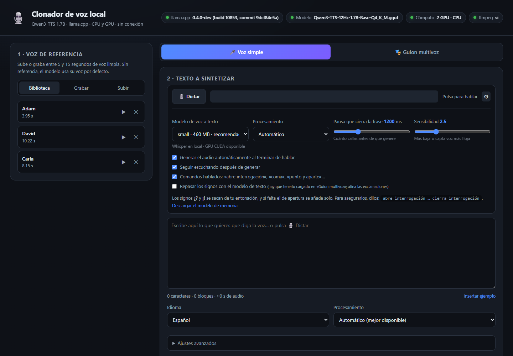
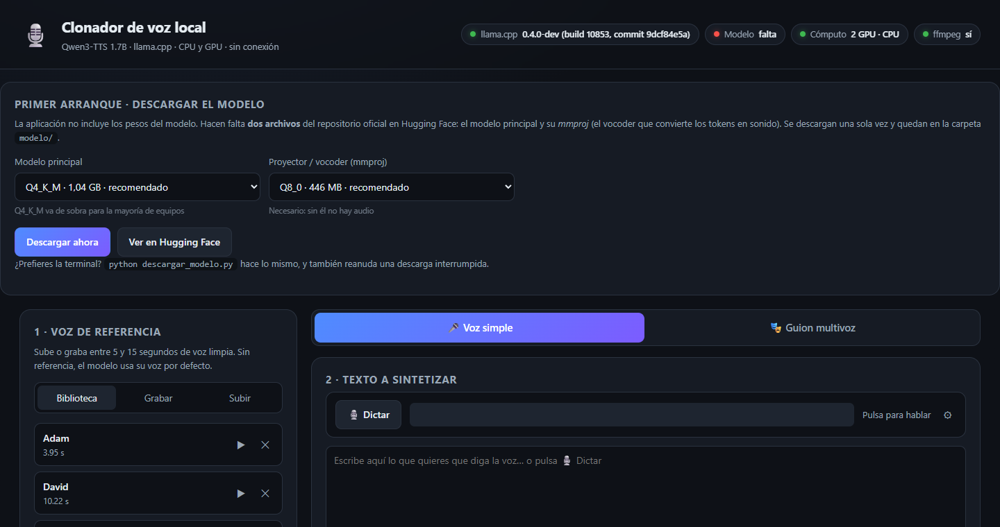
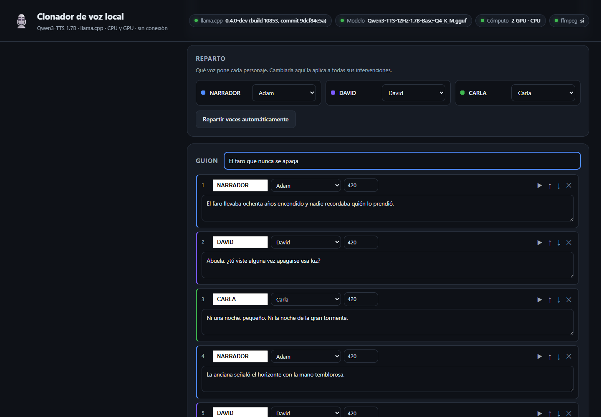
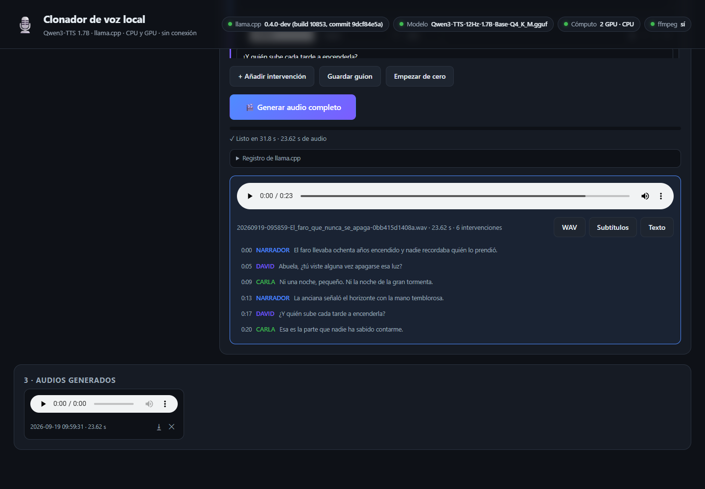

<h1 align="center">🎙️ Clonar voz · v2</h1>

<p align="center">
  Clonación de voz, dictado y cuentos a varias voces. <b>100 % local</b>.<br>
  Funciona igual en <b>CPU</b> que en <b>GPU</b>. Nada sale de tu ordenador.
</p>

<p align="center">
  
  
  
  
</p>

<p align="center">
  
</p>

---

Graba **10 segundos** de una voz, escribe (o dicta) un texto, y lo oyes con esa
misma voz. Todo en tu máquina: sin API, sin cuenta, sin subir audio a ningún
servidor.

> **v1 → v2.** La [versión 1](https://github.com/jceronch1/Clonar-voz) hacía
> texto a voz con clonación. La v2 añade **dictado por micrófono** con
> generación automática y un modo de **guion a varias voces** escrito por un
> modelo de lenguaje local.

### Qué hace

| | |
|---|---|
| 🎤 **Clonación por muestra** | graba desde el navegador o sube un archivo |
| 🗣️ **Dictado con pausa automática** | hablas, callas, y genera solo — sin tocar el botón |
| 🎭 **Guion multivoz** | cada personaje con su voz, en un único audio con subtítulos |
| 🤖 **Escritura con IA local** | usa los modelos que ya tengas en Ollama, servidos por llama.cpp |
| 🌍 **10 idiomas** | español, inglés, chino, alemán, italiano, portugués, japonés, coreano, francés y ruso |
| ⚡ **CPU y GPU** | eliges el modo en cada generación; prioriza la GPU dedicada |
| 🔒 **Sin conexión** | tras la instalación funciona con el wifi apagado |

Motores: [**Qwen3-TTS-12Hz-1.7B**](https://huggingface.co/ggml-org/Qwen3-TTS-12Hz-1.7B-Base-GGUF)
sobre [**llama.cpp**](https://github.com/ggml-org/llama.cpp) para la voz, y
[**faster-whisper**](https://github.com/SYSTRAN/faster-whisper) para el dictado.

---

## 📦 Instalación paso a paso

> Los pesos del modelo (~1,5 GB) **no vienen en el repositorio**: la aplicación
> los descarga en el primer arranque.

### Paso 1 — Python 3.10 o superior

Descárgalo de [python.org/downloads](https://www.python.org/downloads/).

> ⚠️ **En Windows marca «Add python.exe to PATH»** durante la instalación. Es el
> fallo más común.

```bash
python --version
```

### Paso 2 — llama.cpp

Es el motor que ejecuta los modelos. **Hace falta la build b10500 o superior**:
el soporte de Qwen3-TTS llegó en agosto de 2026 y las versiones anteriores no
sirven.

```bash
winget install ggml.llamacpp
```

<sub>macOS: <code>brew install llama.cpp</code> · Linux: binarios en las
<a href="https://github.com/ggml-org/llama.cpp/releases">releases oficiales</a>.</sub>

```bash
llama-tts --version
```

### Paso 3 — ffmpeg

Convierte el audio de referencia y el del micrófono al formato que esperan los
modelos.

```bash
winget install Gyan.FFmpeg
```

<sub>macOS: <code>brew install ffmpeg</code> · Linux: <code>sudo apt install ffmpeg</code></sub>

### Paso 4 — Descargar el repositorio

```bash
git clone https://github.com/jceronch1/Clonar-voz-v2.git
cd Clonar-voz-v2
```

<sub>Sin git: botón verde <b>Code → Download ZIP</b> y descomprime.</sub>

### Paso 5 — Arrancar

**Windows** — doble clic en **`iniciar.bat`**

**Linux / macOS**

```bash
chmod +x iniciar.sh && ./iniciar.sh
```

El lanzador instala las dependencias, comprueba llama.cpp y te ofrece descargar
el modelo. Luego abre <http://127.0.0.1:8080>.

### Paso 6 — Descargar el modelo de voz

Si no lo hiciste antes, la web te recibe con este panel:

<p align="center">
  
</p>

Son **dos archivos** y hacen falta los dos:

| Archivo | Tamaño | Para qué |
|---|---|---|
| `Qwen3-TTS-12Hz-1.7B-Base-Q4_K_M.gguf` | 1,04 GB | genera los tokens de audio |
| `mmproj-Qwen3-TTS-12Hz-1.7B-Base-Q8_0.gguf` | 446 MB | vocoder: los convierte en sonido |

Sin el `mmproj` el modelo carga pero no sale audio. La descarga es reanudable y
verifica el SHA-256. Desde la terminal es lo mismo:

```bash
python descargar_modelo.py
```

### Paso 7 *(opcional)* — Dictado por micrófono

```bash
pip install -r requirements-dictado.txt
```

Arrastra `ctranslate2` y, con GPU NVIDIA, las librerías de CUDA: alrededor de
1 GB. **Sin esto la aplicación funciona igual**, solo que el botón «Dictar»
aparece desactivado. El modelo de Whisper se descarga solo la primera vez.

---

## ▶️ Los dos modos

### 🎤 Voz simple

Eliges una voz de la biblioteca, escribes el texto y pulsas **Generar audio**
(o `Ctrl + Enter`).

**O lo dictas.** Pulsa **🎙️ Dictar**: calibra el ruido de fondo, escucha, y
cuando te callas más de la pausa configurada (1,2 s por defecto) transcribe y
**genera el audio automáticamente, sin que toques nada**. Con el modo continuo,
en cuanto termina de sonar vuelve a escuchar.

Los signos **¿?** y **¡!** se sacan de tu entonación, y si falta el de apertura
se añade solo. Para asegurarlos puedes decirlos: *«abre interrogación … cierra
interrogación»*. Detalles y limitaciones honestas en
**[docs/dictado.md](docs/dictado.md)**.

### 🎭 Guion multivoz

<p align="center">
  
</p>

1. **Carga un modelo de texto** — los que ya tengas en Ollama aparecen solos.
2. **Describe la historia** y pulsa *Escribir guion*. El texto va saliendo en
   directo y se convierte en intervenciones.
3. **Reparte las voces**: cada personaje con la suya.
4. **Ajusta** lo que quieras: editar texto, cambiar voz, pausas, reordenar, y un
   ▶ para escuchar una intervención suelta antes de lanzar todo.
5. **Genera el audio completo.**

<p align="center">
  
</p>

Sale el WAV completo, los **subtítulos `.srt`** con los tiempos reales de cada
intervención, el guion en `.txt`, y una línea de tiempo clicable que resalta lo
que está sonando. Más en **[docs/guion-multivoz.md](docs/guion-multivoz.md)**.

> También puedes pegar tu propio texto con el formato `[PERSONAJE] frase` y
> convertirlo en guion, sin usar ningún modelo de lenguaje.

---

## ⚡ CPU y GPU

En el desplegable **Procesamiento**:

| Opción | Cuándo |
|---|---|
| **Automático** | por defecto: coge la mejor GPU detectada |
| **GPU concreta** | si tienes varias; la marcada con ★ es la recomendada |
| **Solo CPU** | equipos sin GPU, o si Vulkan/CUDA da problemas |

La aplicación **prioriza la GPU dedicada sobre la integrada**, porque llama.cpp
por defecto suele coger la primera que encuentra, y en muchos portátiles esa es
la integrada.

### El detalle que multiplica el rendimiento por 15

No basta con `-ngl 99`. Si el **vocoder** (el `mmproj`) no se descarga también
en la GPU, se queda en la CPU y se convierte en el cuello de botella. Esta app
siempre pasa `-mmdev` junto con `--device`:

```bash
# GPU
llama-tts -m modelo/Qwen3-TTS-...gguf -mm modelo/mmproj-...gguf \
  -p "texto" --tts-lang es --tts-speaker-file voces/<id>/referencia.wav \
  -o salida.wav -ngl 99 --device Vulkan1 -mmdev Vulkan1

# CPU
llama-tts ... -ngl 0 --device none --no-mmproj-offload
```

Misma frase de ~4 s en un portátil con RTX 4070 (Vulkan):

| Modo | Total | Vocoder |
|---|---:|---:|
| GPU **con** `-mmdev` | **1,9 s** | 0,14 s |
| GPU sin `-mmdev` | 29,7 s | 23,6 s |
| Solo CPU (16 hilos) | 4,7 s | 2,2 s |

Incluso en CPU pura es perfectamente usable.

### Convivencia en la VRAM

Un modelo de texto de 5 GB y el de voz no caben a la vez en una tarjeta de 8 GB.
El selector **Al sintetizar voz** decide qué hacer: *liberar la GPU si hace
falta* (por defecto), *liberar siempre* o *mantenerlo cargado*. Al cerrar el
servidor se matan los procesos para no dejar VRAM ocupada.

---

## 🗂️ Voces de ejemplo

El repositorio trae tres voces de referencia listas para probar:
**Adam**, **David** y **Carla**. Están en `voces/` y aparecen en la biblioteca
nada más arrancar.

Las voces que grabes o subas tú se quedan en tu equipo: `.gitignore` solo deja
pasar esas tres.

---

## 📁 Estructura

```
Clonar-voz-v2/
├── app.py                    servidor web (FastAPI) y orquestación
├── llm.py                    modelos de texto: Ollama + llama-server
├── dictado.py                voz a texto, puntuación y comandos hablados
├── descargar_modelo.py       descarga reanudable de los .gguf
├── iniciar.bat / iniciar.sh  arranque en un clic
├── requirements.txt          dependencias base
├── requirements-dictado.txt  dictado (opcional)
├── modelo/                   los .gguf de voz (no van en el repo)
├── modelos-texto/            .gguf de texto sueltos (opcional)
├── voces/                    Adam, David y Carla + las tuyas (privadas)
├── salidas/                  audios generados (se crea sola)
├── guiones/                  guiones guardados (se crea sola)
├── static/                   interfaz web
└── docs/                     documentación y capturas
```

`config.json` se crea al guardar ajustes. Acepta rutas manuales en `binario`,
`modelo` y `mmproj` si quieres apuntar a otra instalación de llama.cpp. Vacío =
autodetección.

---

## 🔌 API

El servidor expone una API por si quieres automatizarlo. El progreso de las
tareas largas se sigue por SSE en `/api/tarea/{id}/eventos`.

| Método | Ruta | Para qué |
|---|---|---|
| `GET` | `/api/estado` | binario, modelo, GPUs detectadas, configuración |
| `POST` | `/api/modelo/descargar` | descarga los pesos (progreso en SSE) |
| `GET` `POST` `DELETE` | `/api/voces` | biblioteca de voces |
| `POST` | `/api/generar` | sintetiza un texto |
| `POST` | `/api/dictado/transcribir` | audio → texto ya puntuado |
| `GET` | `/api/llm/modelos` | modelos de texto disponibles |
| `POST` | `/api/llm/cargar` | arranca llama-server con uno |
| `POST` | `/api/llm/guion` | escribe un guion (SSE) |
| `POST` | `/api/guion/sintetizar` | genera el audio multivoz (SSE) |
| `GET` `DELETE` | `/api/salidas` | historial de audios |

```bash
curl -X POST http://127.0.0.1:8080/api/generar \
  -H "Content-Type: application/json" \
  -d '{"texto":"Hola mundo","idioma":"es","dispositivo":"auto"}'
```

---

## 🛠️ Problemas frecuentes

**«Tu llama.cpp no admite Qwen3-TTS»**
Build anterior al soporte: `winget upgrade ggml.llamacpp` y reinicia.

**«No se encuentra llama-tts»**
No está en el PATH. Cierra y reabre la terminal, o pon la ruta completa en
`config.json` → `"binario"`.

**Va lento aunque tengo GPU**
Comprueba que no esté seleccionada la gráfica integrada: elige la marcada con ★.

**Un modelo de Ollama no carga**
No todos valen: algunas variantes traen metadatos que llama.cpp aún no entiende.
Pulsa **Comprobar compatibilidad** y te dirá el error exacto.

**La descarga del modelo se cortó**
Vuelve a lanzarla: continúa donde iba.

**El micrófono no graba / «Dictar» desactivado**
Falta `faster-whisper` (paso 7) o ffmpeg.

**La voz clonada no se parece**
Referencia más larga (10-15 s), limpia y de una sola persona; rellena la
transcripción y baja la temperatura a 0,6-0,7.

---

## ⚖️ Uso responsable

Clonar la voz de una persona sin su permiso es **ilegal en muchos países** y, en
cualquier caso, un abuso. Usa solo voces propias o con consentimiento explícito.
No la uses para suplantar identidades, engañar ni acosar.

---

## 🙏 Créditos

- [Qwen3-TTS](https://huggingface.co/ggml-org/Qwen3-TTS-12Hz-1.7B-Base-GGUF) — modelo de voz, del equipo Qwen de Alibaba, en GGUF por ggml-org
- [llama.cpp](https://github.com/ggml-org/llama.cpp) — motor de inferencia
- [faster-whisper](https://github.com/SYSTRAN/faster-whisper) — voz a texto
- [Soporte de Qwen3-TTS en llama.cpp](https://github.com/ggml-org/llama.cpp/pull/26254) — PR de ngxson

Código bajo licencia [MIT](LICENSE). Los modelos tienen su propia licencia.
